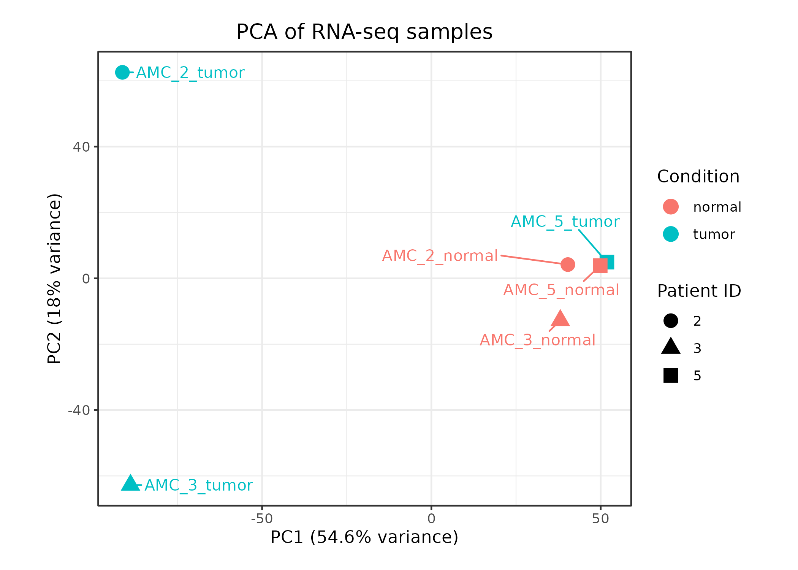
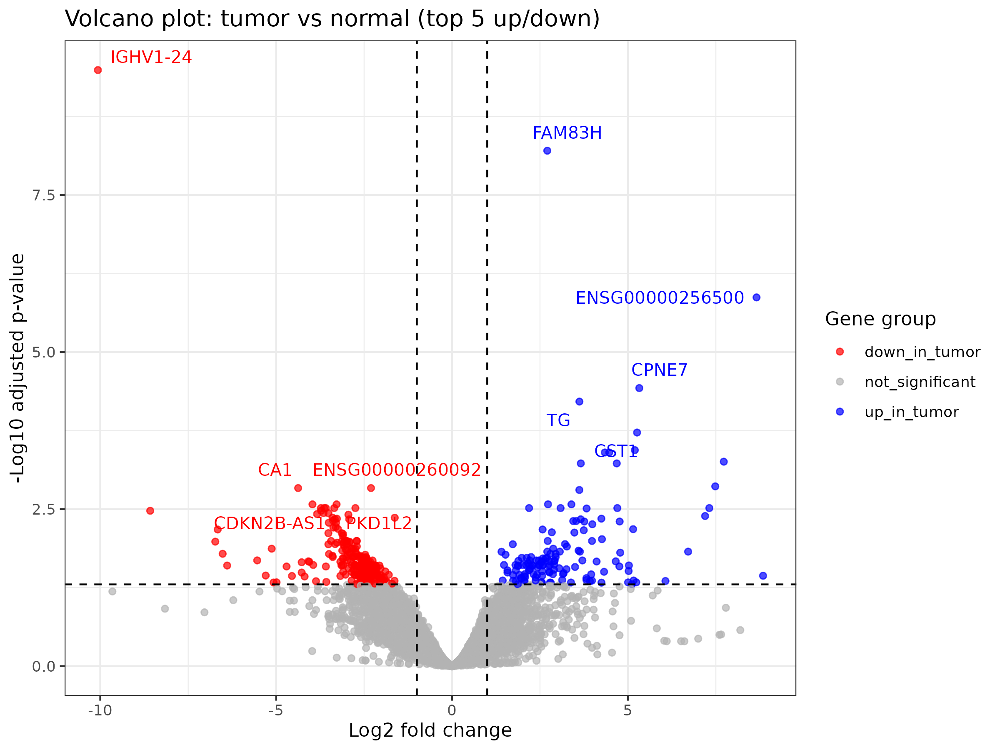
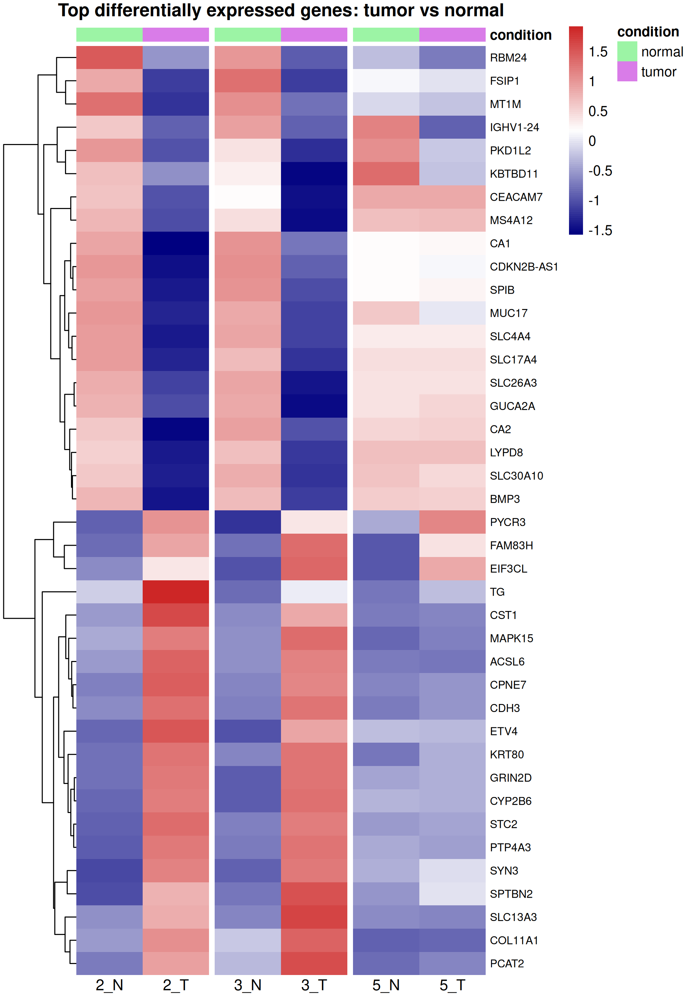
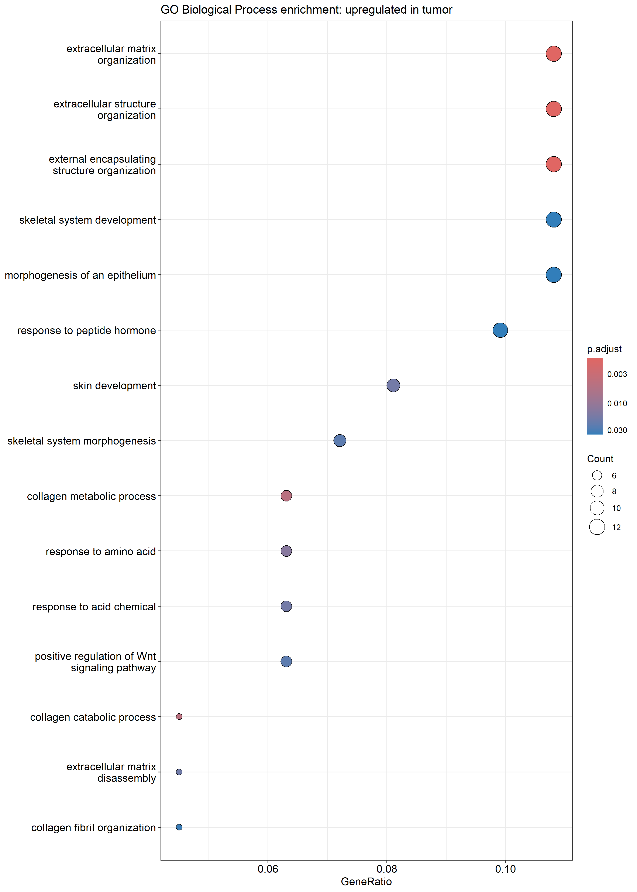
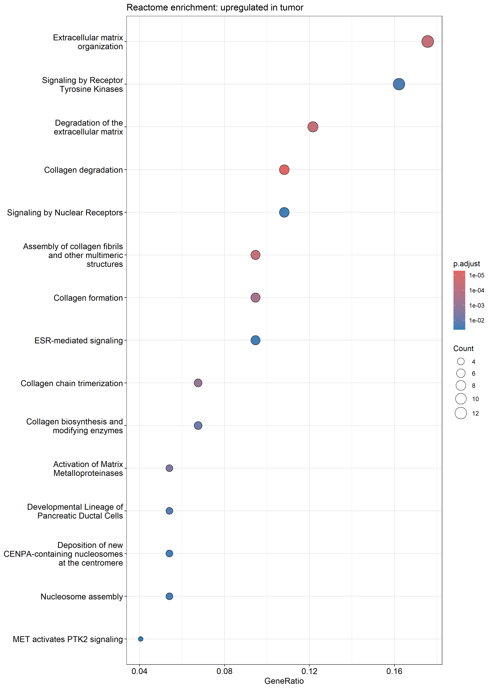

# RNA-seq CRC

## Project overview

This project is a start to finish bulk RNA-seq analysis of a public colorectal cancer dataset using 3 paired patients. Each patient has a matched tumor and normal sample.

The project goes through a full RNA-seq workflow from raw data through quantification, differential expression analysis, plotting, and enrichment analysis.

## Dataset

Public dataset: GSE50760

The final analysis scope, due to time and space constraints, is a reduced paired subset of 3 patients:
- patient 2
- patient 3
- patient 5

Samples used:
- AMC_2_normal
- AMC_2_tumor
- AMC_3_normal
- AMC_3_tumor
- AMC_5_normal
- AMC_5_tumor

## Workflow

The workflow was run in Ubuntu/WSL and includes:
1. Metadata preparation and subset definition
2. FASTQ download and file organization
3. FastQC
4. Reference transcriptome setup
5. tx2gene creation
6. Salmon index building
7. Salmon quantification
8. tximport import into R
9. Paired differential expression analysis with DESeq2
10. Exploratory plots
11. Results summary tables
12. Volcano plots
13. Top gene heatmap
14. Over-representation analysis for upregulated and downregulated gene sets

## Envi

- Ubuntu / WSL
- bash

## Tools

- SRA Toolkit
- FastQC
- Salmon
- R
- Bioconductor
- tximport
- DESeq2
- clusterProfiler
- ReactomePA
- ggplot2
- pheatmap
- AnnotationDbi
- org.Hs.eg.db

## What the analysis shows

The tumor and normal samples separate from each other across the main exploratory plots.

The normal samples cluster more tightly, while the tumor samples are more variable.

Patients 2 and 3 show the clearest shift between "normal" and "tumor" conditions. Patient 5 still differs, but the tumor sample stays closer to the normal samples than the other two tumor samples.

The volcano plot and top gene heatmap show that the tumor/normal difference is driven by a subset of genes with consistent expression changes across the paired samples, especially for patients 2 and 3.

The enrichment analysis helps summarize the differential expression results at pathway and process level. Genes upregulated in tumor are mainly linked to extracellular matrix, collagen, and tissue structure related processes. Genes downregulated in tumor are mainly linked to immune related and transport/signaling related processes.

## Key results

### PCA
Tumor and normal samples separate across the main variation in the dataset, with patient 5 showing a weaker shift than patients 2 and 3.

### Volcano plot
The tumor-normal comparison is driven by a subset of genes with clear fold changes and adjusted p-values.

### Top differentially expressed genes
The top-gene heatmap shows a consistent tumor-normal pattern, especially for patients 2 and 3.

### GO Biological Process enrichment
Upregulated genes are mainly enriched for extracellular matrix, collagen, and tissue structure-related processes.

### Reactome enrichment
Reactome enrichment shows the same broad pattern, with extracellular matrix and collagen-related pathways among the strongest signals.

## Project status

Done.

## Repository contents

- `scripts/` – analysis scripts
- `data/metadata/` – metadata and subset definition files
- `reference/` – reference files and Salmon index
- `results/` – analysis outputs

## Script order

The main analysis was run in this order:

1. `download_fastq_one_by_one.sh`  
   Downloads the selected FASTQ files for the 3 patient subset.

2. `make_tx2gene.R`  
   Builds the transcript to gene mapping table from the GENCODE annotation.

3. `run_salmon_quant_3patients.sh`  
   Runs Salmon quantification for the 6 selected samples.

4. `tximport_3patients.R`  
   Imports Salmon quantification files into R and creates gene-level matrices.

5. `deseq2_3patients.R`  
   Runs the paired differential expression analysis with DESeq2.

6. `deseq2_exploration_3patients.R`  
   Creates exploratory outputs including PCA, sample distance heatmap, and MA plot.

7. `deseq2_results_summary_3patients.R`  
   Creates cleaned DE result tables, summary statistics, and volcano plots.

8. `deseq2_top_heatmap_3patients.R`  
   Builds the heatmap of the top differentially expressed genes.

9. `enrichment_ora_3patients.R`  
   Runs over-representation analysis on upregulated and downregulated gene sets and creates enrichment plots.

Each script saves its outputs in the corresponding folder under `results/`.
